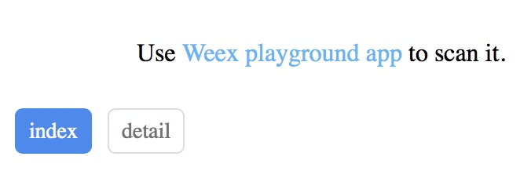

# Weex 创建多页面工程

初学 Weex ，遇到很多问题，其中就有多页面的问题。

最开始看的 vue-router，很多资料建议使用 vue-router 进行页面切换。

大概看了一点资料，vue-router 有些类似移动端的 tabController, 需要显示的页面作为 component，在 router.js 中进行注册。

在显示的地方调用 <router-view /> 进行显示，通过 router-link 进行页面的切换。

但是这个不是我想要的效果，我更多的想要的是两个独立的页面之间进行切换。

## 第一步：提供二个页面入口

weex create 创建一个新工程 pagesdemo，默认创建的都是单页面工程，在工程的 src 目录下包含 index.vue 和 entry.js。

创建一个新的入口，同样需要提供这两个问题。在同级目录下新增一个 detail.vue 和 detail.js。

detail.js 需要修改为：

```
const router = require('./router')
const detail = require('@/detail.vue')

new Vue(Vue.util.extend({el: '#root', router}, detail))
```

## 第二步：修改 webpack

新增文件后，npm start 并不会编译新增的文件。如果想要文件被编译，还需要修改 webpack 文件。

工程目录下的 webpack.config.js 内容如下：

```
// You can see all the config in `./configs`.
const  buildPlugins = require('./configs/plugin');
let webpackConfig;
module.exports = env => {
  switch (env.NODE_ENV) {
    case 'prod':
    case 'production':
      webpackConfig = require('./configs/webpack.prod.conf');
      break;
    case 'test':
    case 'testing':
      webpackConfig = require('./configs/webpack.test.conf');
      break;
    case 'plugin':
      buildPlugins();
    case 'common':
      webpackConfig = require('./configs/webpack.common.conf');
      break;
    case 'release':
      webpackConfig = require('./configs/webpack.release.conf');
      break;
    case 'dev':
    case 'development':
    default:
      webpackConfig = require('./configs/webpack.dev.conf');
  }
  return webpackConfig;
}
```
可以看到，dev 下使用的是 configs 目录下的 webpack.dev.conf

### 使用 npm start 查看浏览器运行效果

运行 npm start 后，通过浏览器可以看到显示的是 html 文件。web 编译后的文件存放在工程目录下的 web 文件下，打开文件夹可以看到有 index.html 文件，所以接下来我们需要查一下如何生成 html 入口文件。

查看 index.html 的源码：

```
<!DOCTYPE html>
<html>
<head>
  <meta charset="utf-8">
  <title>Index</title>
  <meta name="weex-viewport" content="750">
  <meta name="viewport" content="width=device-width, initial-scale=1, user-scalable=no">
  <meta name="apple-mobile-web-app-capable" content="yes">
  <meta name="apple-touch-fullscreen" content="yes"><meta name="apple-mobile-web-app-status-bar-style" content="black">
  <meta name="format-detection" content="telephone=no, email=no">
  <style>
    html, body, #weex {
      width: 100%;
      height: 100%;
    }
    html, body {
      -ms-overflow-style: scrollbar;
      -webkit-tap-highlight-color: transparent;
      padding: 0;
      margin: 0;
      width: 100%;
      height: 100%;
      overflow-x: hidden;
      -webkit-overflow-scrolling: touch;
    }
    body::before {
      content: "1";
      height: 1px;
      overflow: hidden;
      color: transparent;
      display: block;
    }
  </style>
</head>
<body>
  <div id="root"></div>
</body>
<%= htmlWebpackPlugin.options.devScripts %>
</html>
```

从源码中可以看到，index.html 是通过 <%= htmlWebpackPlugin.options.devScripts %> 获得需要显示的内容，那 htmlWebpackPlugin.options.devScripts 是什么东西呢？

带着疑问，我们回到 webpack.dev.conf 文件中


```
module.exports = new Promise((resolve, reject) => {
  portfinder.basePort = process.env.PORT || config.dev.port
  portfinder.getPort((err, port) => {
    if (err) {
      reject(err)
    } else {
      // publish the new Port, necessary for e2e tests
      process.env.PORT = port
      // add port to devServer config
      devWebpackConfig.devServer.port = port
      devWebpackConfig.devServer.public = `${ip}:${port}`
      // Add FriendlyErrorsPlugin
      devWebpackConfig.plugins.push(new FriendlyErrorsPlugin({
        compilationSuccessInfo: {
          messages: [
            `Your application is running here: ${chalk.yellow(`http://${devWebpackConfig.devServer.host}:${port}`)}.`
          ],
        },
        onErrors: config.dev.notifyOnErrors
        ? utils.createNotifierCallback()
        : undefined
      }))

      resolve(devWebpackConfig)
    }
  })
})
```

在 module.exports 使用了 devWebpackConfig。

```
const devWebpackConfig = webpackMerge(commonConfig[0], {
  module: {
    rules: utils.styleLoaders({ sourceMap: config.dev.cssSourceMap, usePostCSS: true })
  },
  devtool: config.dev.devtool,
  plugins: [
    new webpack.DefinePlugin({
      'process.env': {
        'NODE_ENV': config.dev.env
      }
    }),
    
    ...generateHtmlWebpackPlugin(commonConfig[0].entry),
    
    new ScriptExtHtmlWebpackPlugin({
      defaultAttribute: 'defer'
    })
  ],
  devServer: {
    clientLogLevel: 'warning',
    compress: true,
    contentBase: config.dev.contentBase,
    host: config.dev.host,
    port: config.dev.port,
    historyApiFallback: config.dev.historyApiFallback,
    public: config.dev.public,
    open:config.dev.open,
    watchContentBase: config.dev.watchContentBase,
    overlay: config.dev.errorOverlay
    ? { warnings: false, errors: true }
    : false,
    proxy: config.dev.proxyTable,
    quiet: true, // necessary for FriendlyErrorsPlugin
    openPage: encodeURI(openPage),
    watchOptions: config.dev.watchOptions
  }
});

const weexConfig = webpackMerge(commonConfig[1], {
  watch: true
})
```

其中 plugins 调用了 generateHtmlWebpackPlugin

```
const generateHtmlWebpackPlugin = (entry) => {
  let entrys = Object.keys(entry);
  // exclude vendor entry.
  entrys = entrys.filter(entry => entry !== 'vendor' );
  const htmlPlugin = entrys.map(name => {
    return new HtmlWebpackPlugin({
      multihtmlCache: true,
      filename: name + '.html',
      template: helper.rootNode(`web/index.html`),
      isDevServer: true,
      chunksSortMode: 'dependency',
      inject: true,
      devScripts: config.dev.htmlOptions.devScripts,
      chunks: ['vendor', name]
    })
  })
  return htmlPlugin;
}
```

从方法中可以看出，这个是返回一个 html 插件，模板为 web/index.html。 很显然这里就是生成 html 的地方。那参数 commonConfig[0].entry 就是提供的全部入口文件


```
const commonConfig = require('./webpack.common.conf');
```

在 webpack.dev.conf 第一行，可以看出数据的提供方为 webpack.common.conf

### 修改 webpack.common.conf 支持浏览器运行

查看 module.exports

```
module.exports = [webConfig, weexConfig];
```

从 module.exports 可以看出，数据由 webConfig 提供，查看 webConfig 的源码：

```
const webConfig = {
  entry: Object.assign(webEntry, {
    'vendor': [path.resolve('node_modules/phantom-limb/index.js')]
  }),
  output: {
    path: helper.rootNode('./dist'),
    filename: '[name].web.js'
  },
  …………
```

这里只是指明了编译的 web.js 文件的位置，dist 目录下，那 webEntry 如何获取的呢？


```
const getEntryFile = () => {
  const entryFile = path.join(vueWebTemp, config.entryFilePath)
  const routerFile = path.join(vueWebTemp, config.routerFilePath)
  fs.outputFileSync(entryFile, getEntryFileContent(helper.root(config.entryFilePath), routerFile));
  fs.outputFileSync(routerFile, getRouterFileContent(helper.root(config.routerFilePath)));
 
  return {
    index: entryFile
  }
}

const webEntry = getEntryFile();
```

从源码中可以看出，getEntryFile 是用来获取所有的入口问题，那我们来修改一下：

```
const getEntryFile = () => {
  const entryFile = path.join(vueWebTemp, config.entryFilePath)
  const routerFile = path.join(vueWebTemp, config.routerFilePath)
  fs.outputFileSync(entryFile, getEntryFileContent(helper.root(config.entryFilePath), routerFile));
  fs.outputFileSync(routerFile, getRouterFileContent(helper.root(config.routerFilePath)));

>   const detailFilePath = 'detail.js'
>   const detailFile = path.join(vueWebTemp, modifyFilePath)
>   fs.outputFileSync(detailFile, getEntryFileContent(helper.root(detailFilePath), detailFile));
 
  return {
    index: entryFile,
    detail: detailFile,
  }
}

```

新增 detail 的配置。

重新运行 npm start ，可以看到浏览器中有了2个页面的标签




### 修改 webpack.common.conf 支持生成多个 jsbundle

和浏览器显示 html 的原理一下，端上需要显示 js 文件。


```
const weexConfig = {
  entry: weexEntry,
  output: {
    path: path.join(__dirname, '../dist'),
    filename: '[name].js'
  },
```

可以看到 js 源文件的提供方为 weexConfig， 查看源码，比起浏览器要简单很多，只需要简单修改配置。

```
const weexEntry = {
  'index': helper.root('entry.js'),
>   'detail': helper.root('detail.js')
}
```

## 第三步：添加 navigator 跳转

在需要跳转的地方添加此方法

```
let bundleUrl = weex.config.bundleUrl
let nativeBase
let host = 'localhost:8080'
let matches = /\/\/([^/]+?)\//.exec(bundleUrl)
if (matches && matches.length >= 2) {
  host = matches[1]
}
if (weex.config.env.platform === 'iOS') {
  nativeBase = 'http://' + host + '/dist/modify.js'
} else {
  nativeBase = 'http://' + host + '/modify.html'
}       
navigator.push({
  url: nativeBase,
  animated: "true"
}, null)
```

weex 提供了一些环境变量，通过 platform 可以获取到设备类型，除此之外，还有很多其他字段：
http://weex.apache.org/cn/references/weex-variable.html

## 总结

搜索和很多资料，终于解决了问题，不过使用 weexplayground 扫描跳转还有问题，目前正在解决。解决后，再补充。

## 参考资料

https://www.jianshu.com/p/ae1d7a2b0a8a
https://blog.csdn.net/u012182853/article/details/80559363
https://blog.csdn.net/u012182853/article/details/80559363
https://www.jianshu.com/p/a0c4c8f3ad2d
https://juejin.im/entry/5a0938586fb9a0451a75e010

